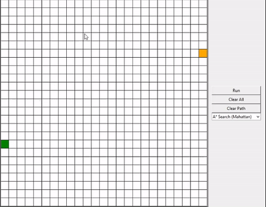
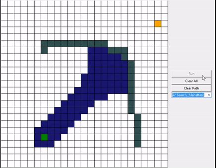
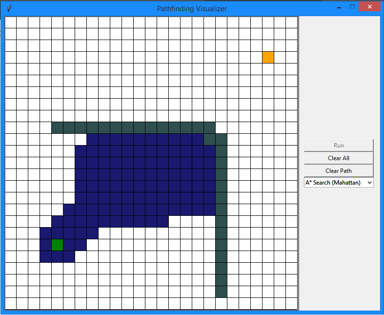
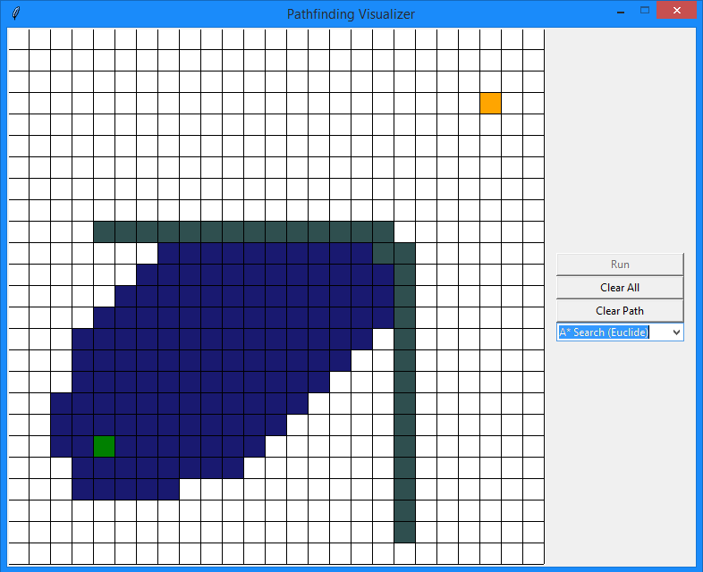
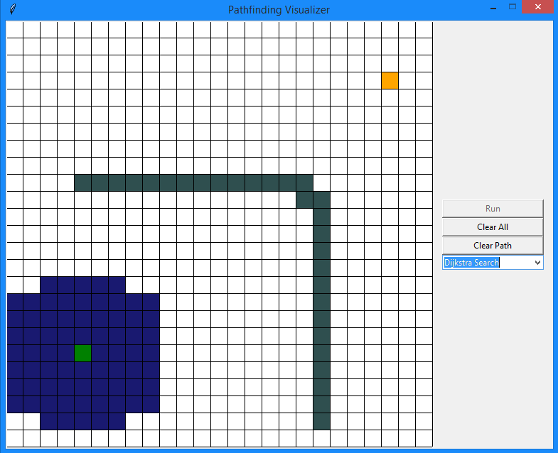
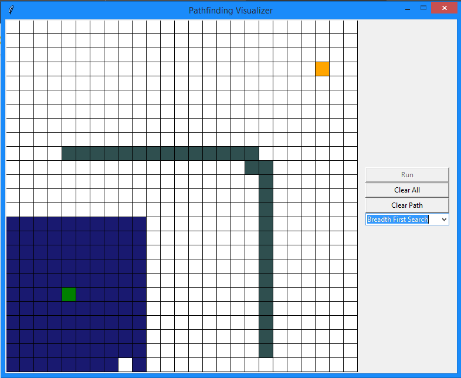
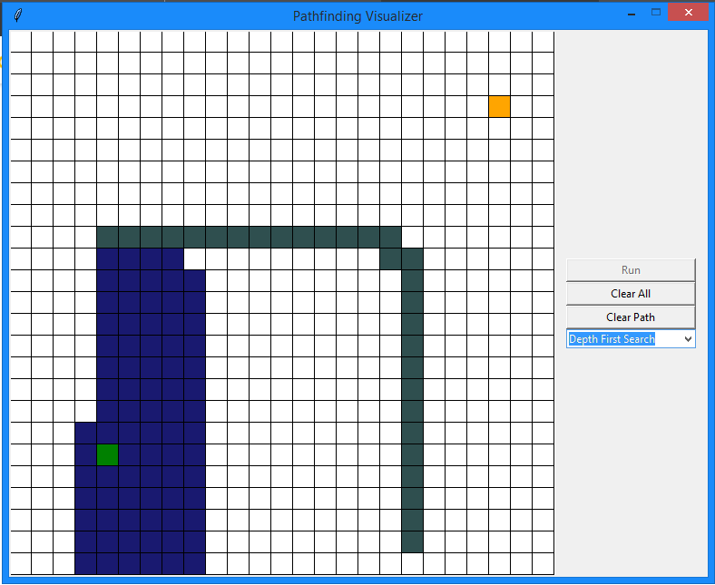

# pathfinding-visualizer
Simple Pathfinding Visualizer made from Python Tkinter

# Hướng dẫn sử dụng
- Kéo ô trắng để tạo wall
- Kéo ô tường để xóa tường
- Ô xanh lá là điểm bắt đầu, ô cam là điểm kết thúc. Kéo 2 ô để di chuyển vị trí

- Chọn thuật toán, click Run để chạy
- Click Clear Path để xóa đường đi cũ
- Click Clar All để xóa hết tất cả
(Trong lúc chạy vẫn có thể Clear Path và Clear All được, nhưng Run thì không)

# Nhận xét
- Astar Search: Mở các nút hướng tới điểm kết thúc (Đo bằng Mahattan thì mở vuông hơn)

	

- Dijkstra Search: Mở các nút theo hình tròn

- Breadth First Search: Mở các nút theo hình vuông

- Depth First Search: Mở 1 nút cho tới chết rồi lặp lại

# Ưu điểm
- GUI thân thiện, dễ xài.
- Visualize được nhiều thuật toán.

# Nhược điểm
- Code dơ, chưa tối ưu.
- Code phần chạy chưa mượt nên chạy nhiều lần sẽ bị chậm.
- Không đẹp bằng mấy cái trên mạng.

# Kết luận:
Nên xài Pygame hơn là Tkinter, vì lần đầu làm GUI nên không nghĩ là phần đồ họa lại quá khó như vậy.

# Dự định
Nếu mà siêng thì sẽ thêm chỉnh tốc chạy, chỉnh kích thước board, v.v..

